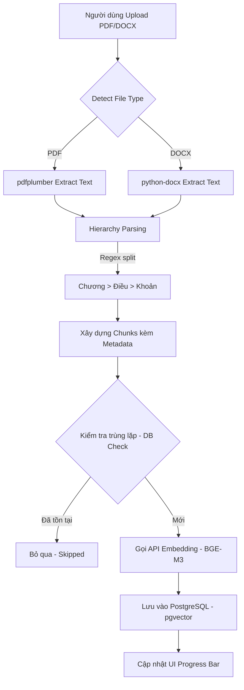
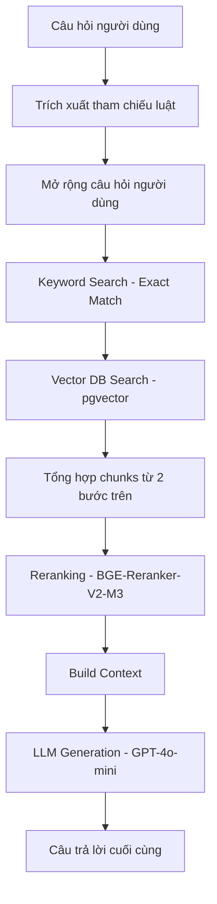

# BÁO CÁO THỰC HIỆN DỰ ÁN CHATBOT TRA CỨU LUẬT

## 1. Giới thiệu tổng quan

Dự án nhằm xây dựng một hệ thống Chatbot thông minh hỗ trợ tra cứu văn bản pháp luật Việt Nam. Hệ thống sử dụng công nghệ RAG (Retrieval-Augmented Generation) để cung cấp câu trả lời chính xác, có trích dẫn nguồn luật cụ thể, giúp người dùng dễ dàng tiếp cận thông tin pháp lý.

## 2. Kiến trúc hệ thống

Hệ thống được thiết kế theo mô hình **MVC (Model-View-Controller)** đảm bảo tính tách biệt giữa logic nghiệp vụ, dữ liệu và giao diện:

- **Model**: Quản lý kết nối cơ sở dữ liệu PostgreSQL, thực hiện vector search và CRUD dữ liệu luật.
- **View**: Giao diện người dùng xây dựng trên nền tảng **Streamlit**, hỗ trợ upload file và tương tác chat.
- **Controller**: Điều phối luồng dữ liệu giữa View và Model, quản lý quy trình Ingest và Chat.

## 3. Công nghệ sử dụng (Tech Stack)

- **Ngôn ngữ**: Python 3.11+
- **Giao diện**: Streamlit
- **Cơ sở dữ liệu**: PostgreSQL với tiện ích mở rộng **pgvector** để lưu trữ và tìm kiếm vector.
- **LLM**: Sử dụng qua **OpenRouter** (ưu tiên model `gpt-4o-mini`).
- **Framework RAG**: LangChain với kiến trúc LCEL (LangChain Expression Language).

## 4. Các tính năng chính và kết quả thực hiện

### 4.1. Xử lý và nạp dữ liệu (Data Ingestion)

- **Parsing nâng cao**: Hỗ trợ đọc file PDF và DOCX. Hệ thống có khả năng bóc tách cấu trúc phân cấp phức tạp: **Chương > Điều > Khoản**.
- **Hierarchical Chunking**: Dữ liệu được chia nhỏ (chunking) theo đơn vị Điều/Khoản để giữ nguyên ngữ cảnh pháp lý, thay vì chia cắt ngẫu nhiên theo độ dài ký tự.
- **Embedding**: Sử dụng mô hình embedding để chuyển đổi nội dung luật thành vector, lưu trữ vào pgvector.

### 4.2. Pipeline RAG nâng cao (Advanced RAG Pipeline)

Hệ thống không chỉ tìm kiếm vector đơn thuần mà sử dụng quy trình phức tạp để tăng độ chính xác:

1. **Query Expansion (Mở rộng truy vấn)**: Sử dụng LLM để sinh ra các thuật ngữ đồng nghĩa pháp lý từ câu hỏi của người dùng (ví dụ: "lấy trộm" -> "trộm cắp tài sản", "chiếm đoạt").
2. **Hybrid Search**:
   - **Keyword Search**: Tự động nhận diện các tham chiếu trực tiếp (như "Điều 185", "Chương II") để tìm chính xác văn bản.
   - **Vector Search**: Tìm kiếm theo ý nghĩa ngữ nghĩa của câu hỏi.
3. **Reranking (Xếp hạng lại)**: Sử dụng mô hình reranker để chấm điểm lại các ứng viên, đảm bảo những đoạn luật phù hợp nhất được đưa vào prompt.
4. **Threshold-based filtering**: Hệ thống chỉ trả lời khi độ tin cậy của tài liệu tìm thấy vượt ngưỡng quy định (SIM_THRESHOLD, RERANK_THRESHOLD), tránh tình trạng LLM "ảo tưởng".

### 4.3. Hệ thống Debug và Giám sát

- Tự động ghi log các bước trung gian:
  - `debug_candidates.json`: Danh sách các đoạn luật tìm thấy sơ bộ.
  - `debug_results.json`: Kết quả sau khi đã xếp hạng lại.
  - `debug_prompt.txt`: Toàn bộ nội dung prompt gửi cho LLM.

## 5. Kết luận và Hướng phát triển

Hiện tại, hệ thống đã vận hành ổn định với khả năng hiểu sâu văn bản luật và trích dẫn chính xác.

**Hướng phát triển tiếp theo:**

- Hỗ trợ nhiều định dạng file hơn.
- Cải thiện tốc độ reranking bằng các model local.
- Tích hợp thêm tính năng so sánh các thông tư, nghị định hướng dẫn thi hành.

## 6. Chi tiết Luồng Xử lý và Nạp dữ liệu (In-depth Ingestion Flow)

Quy trình nạp dữ liệu được thiết kế tối ưu để đảm bảo tính toàn vẹn của cấu trúc văn bản luật và tiết kiệm tài nguyên hệ thống.

### 6.1. Sơ đồ luồng (Workflow Diagram)



### 6.2. Các giai đoạn kỹ thuật và Ví dụ minh họa

#### 1. Bóc tách phân cấp (Hierarchical Parsing)

Hệ thống sử dụng Regex để nhận diện cấu trúc.

- **Input (Raw Text)**: `"Chương I: NHỮNG QUY ĐỊNH CHUNG... Điều 1: Phạm vi điều chỉnh..."`
- **Output (Hierarchy JSON)**:

  ```json
  {
    "chapters": [{
      "chapter_name": "Chương I",
      "chapter_title": "NHỮNG QUY ĐỊNH CHUNG",
      "articles": [{
        "article_num": 1,
        "article_name": "Phạm vi điều chỉnh",
        "clauses": [{"content": "Bộ luật này quy định..."}]
      }]
    }]
  }
  ```

  - Thay vì chia nhỏ theo độ dài cố định, hệ thống sử dụng Regex để nhận diện các điểm ngắt tự nhiên của văn bản luật (`Chương`, `Điều`, `Khoản`).
  - Điều này giúp mỗi chunk đều mang đầy đủ thông tin định danh (Ví dụ: "Chương I, Điều 5, Khoản 2").

#### 2. Chuẩn hóa Metadata & Chunking

Mỗi đoạn nội dung được đóng gói kèm thông tin định danh.

- **Input**: Hierarchy ở bước trên.
- **Output (Chunk Object)**:

  ```json
  {
    "law_name": "Bộ Luật Dân Sự",
    "chapter": "Chương I",
    "article": 1,
    "content": "Chương I (NHỮNG QUY ĐỊNH CHUNG) Điều 1: Bộ luật này quy định...",
    "chunk_id": "2fbe7eb9...",
    "chunk_index": 0
  }
  ```

  - Mỗi đoạn luật (`chunk`) được gắn kèm: `law_name`, `chapter`, `article`, `clause`, `chunk_id`.
  - Metadata này cực kỳ quan trọng cho tính năng **Keyword Search** và việc trích dẫn nguồn sau này.

#### 3. Cơ chế Kiểm tra trùng lặp

- **Input**: `law_name="Bộ Luật Dân Sự", article=1, clause=None`
- **Logic**: `SELECT 1 FROM law_documents WHERE law_name=%s AND article=%s...`
- **Output**: `True` (Bỏ qua) hoặc `False` (Tiến hành Embedding).
  - Trước khi gửi dữ liệu đi tạo Embedding (một thao tác tốn phí API và thời gian), `ingest_controller` sẽ kiểm tra trong Database xem bộ `(law_name, chapter, article, clause)` đã tồn tại chưa.
  - Nếu đã có, hệ thống sẽ bỏ qua, giúp việc nạp lại dữ liệu hoặc nạp bổ sung diễn ra cực nhanh.

#### 4. Vectorization (BGE-M3)

- **Input**: `content="Chương I (NHỮNG QUY ĐỊNH CHUNG) Điều 1..."`
- **Output**: `[0.012, -0.045, 0.089, ...]` (Vector 1024 chiều).
  - Sử dụng model `baai/bge-m3` với vector 1024 chiều. Đây là model mạnh mẽ trong việc xử lý ngôn ngữ đa phương thức và đa ngữ (hỗ trợ tiếng Việt xuất sắc).

#### 5. Lưu trữ CSDL (PostgreSQL + pgvector)

Đây là bước cuối cùng, đưa dữ liệu vào bảng để sẵn sàng tra cứu.

- **Input**: Chunk Object hoàn chỉnh (bao gồm cả embedding vector).
- **Output (SQL Record)**:

  ```sql
  INSERT INTO law_documents (law_name, chapter, article, content, embedding)
  VALUES (
    'Bộ Luật Dân Sự', 
    'Chương I', 
    1, 
    'Bộ luật này quy định...', 
    '[0.012, -0.045, ...]'
  );
  ```

---

## 7. Chi tiết Pipeline RAG (Retrieval-Augmented Generation)

Quy trình xử lý một câu hỏi từ người dùng đến khi trả về câu trả lời.

### 7.1. Sơ đồ quy trình



### 7.2. Các giai đoạn chi tiết và Ví dụ

#### 1. Mở rộng truy vấn (Query Expansion)

Sử dụng LLM để tìm các thuật ngữ pháp lý đồng nghĩa hoặc liên quan.

- **Input**: `"Người gây tai nạn bỏ chạy bị phạt thế nào?"`
- **Output (Expanded)**: `"Người gây tai nạn bỏ chạy, trách nhiệm dân sự, bồi thường thiệt hại, vi phạm nghĩa vụ..."`

#### 2. Tìm kiếm lai (Hybrid Search)

Kết hợp sức mạnh của Vector (semantic) và Keyword (exact match).

- **Logic**: Lấy tối đa **100** ứng viên (theo `MAX_CANDIDATES_FETCH`) từ Vector Search và toàn bộ các chunk khớp chính xác (Điều, Khoản) từ Keyword Search, sau đó loại bỏ trùng lặp.
- **Input**: Query expansion string và các Điều/Khoản trích dẫn (nếu có).
- **Output**: Danh sách các "ứng viên" (Candidate chunks).

#### 3. Tái xếp hạng (Reranking)

Sử dụng mô hình Cross-Encoder để đánh giá sự liên quan thực sự giữa Câu hỏi và từng Chunk.

- **Input**: Câu hỏi gốc + Danh sách ứng viên.
- **Output**: Chunk được gán điểm `rerank_score`. Ví dụ:

  ```json
  {
    "content": "Điều 351: Trách nhiệm do vi phạm nghĩa vụ...",
    "similarity": 0.64,
    "rerank_score": 0.53
  }
  ```

- **Fallback**: Nếu không có chunk nào đạt ngưỡng 0.7, hệ thống vẫn lấy top 5 tốt nhất để đảm bảo luôn có ngữ cảnh cho LLM.

#### 4. Tổng hợp và Trả lời (LLM Generation)

Xây dựng Prompt hoàn chỉnh và gọi LLM.

- **Prompt Template**:

  ```text
  Bạn là một trợ lý luật sư ảo. Hãy trả lời câu hỏi dựa trên ngữ cảnh sau:
  [Context: Chunks 1, 2, 3...]
  ---
  Câu hỏi: [User Question]
  Trả lời:
  ```

- **Output**: Câu trả lời chuyên nghiệp, có trích dẫn rõ ràng (Điều, Khoản, Tên luật).

### 7.3. Chi tiết kỹ thuật các thành phần tìm kiếm

#### 1. Tìm kiếm Vector (Semantic Search)

- **Công nghệ**: Sử dụng **pgvector** trên PostgreSQL.
- **Độ đo khoảng cách**: Khoảng cách Cosine (`<=>`).
- **Công thức tính độ tương đồng**: `similarity = 1 - (embedding <=> query_vector)`.
- **Tối ưu hóa**: Chỉ lấy các kết quả có `similarity >= 0.6` (cấu hình qua `SIM_THRESHOLD`) để loại bỏ các đoạn luật hoàn toàn không liên quan trước khi đưa vào Reranker.

#### 2. Tìm kiếm Từ khóa & Trích dẫn (Keyword Search)

Đây là "vũ khí bí mật" giúp chatbot xử lý cực tốt các câu hỏi có số hiệu Điều/Khoản cụ thể.

- **Regex Extraction**: Hệ thống sử dụng Regex để "bóc" các tham chiếu luật ngay từ câu hỏi (Ví dụ: "Điều 12", "Chương II").
- **Ưu tiên tuyệt đối**: Các chunk tìm thấy bằng cách khớp chính xác số Điều/Chương được gán điểm `similarity = 1.0`. Điều này đảm bảo các đoạn luật mà người dùng trực tiếp nhắc tới sẽ luôn được đưa vào context của LLM bất kể điểm vector là bao nhiêu.

**Tại sao phải tìm kiếm theo từ khóa (Rationale)?**
Trong lĩnh vực pháp luật, tìm kiếm Vector (Semantic) là chưa đủ vì:

1. **Sai số định danh**: Người dùng thường hỏi chính xác: "Điều 12 Luật X nói gì?". Tìm kiếm Vector đôi khi có thể trả về Điều 13 hoặc Điều 11 do có nội dung tương đồng về ngữ nghĩa, nhưng người dùng lại cần chính xác văn bản của Điều 12.
2. **Thuật ngữ đặc thù**: Một số từ khóa pháp lý hoặc số hiệu văn bản có tính duy nhất. Việc khớp từ khóa đảm bảo 100% không bỏ sót các "điểm neo" quan trọng này.
3. **Ý định rõ ràng**: Khi người dùng trích dẫn số Điều, đó là một "hard constraint" (ràng buộc cứng). Tìm kiếm lai (Hybrid) cho phép hệ thống kết hợp giữa việc "hiểu ý" (Vector) và "lấy đúng đồ" (Keyword).

### 7.4. Mô hình Reranker và Vai trò

#### 1. Mô hình sử dụng

Hệ thống sử dụng **BAAI/bge-reranker-v2-m3**. Đây là một mô hình Cross-Encoder mạnh mẽ hỗ trợ đa ngôn ngữ (bao gồm tiếng Việt).

#### 2. Tại sao cần Reranking?

- **Vector Search (Bi-Encoder)**: Tính toán cực nhanh trên hàng triệu bản ghi nhưng độ chính xác ở mức tương đối vì nó nén toàn bộ ý nghĩa vào một vector duy nhất.
- **Reranker (Cross-Encoder)**: Đánh giá đồng thời cả Câu hỏi và Chunk văn bản trong cùng một lượt. Nó chậm hơn nhưng có khả năng phát hiện những sắc thái ngôn từ nhỏ nhất mà Bi-Encoder có thể bỏ qua.
- **Kết quả**: Giúp lọc bỏ các chunk "trông có vẻ giống" nhưng nội dung thực tế không trả lời được câu hỏi, giúp LLM nhận được ngữ cảnh chất lượng hơn (ít "nhiễu" hơn).

#### 3. Kết quả

Giúp lọc bỏ các chunk "trông có vẻ giống" nhưng nội dung thực tế không trả lời được câu hỏi, giúp LLM nhận được ngữ cảnh chất lượng hơn (ít "nhiễu" hơn).

### 7.5. Chi tiết bước Xây dựng ngữ cảnh (Build Context)

Sau khi có danh sách Top-K chunks từ bước Reranking, hệ thống cần "đóng gói" chúng lại để đưa vào Prompt của LLM.

#### 1. Cấu trúc của một đoạn context (Context Chunk)

Mỗi đoạn luật được trình bày theo định dạng chuẩn hóa để LLM dễ nhận diện:

```text
[Số thứ tự] Tên Luật – Điều X (Tên Điều), Khoản Y (độ tương đồng: 0.XX)
Nội dung chi tiết của đoạn luật...
```

#### 2. Logic xử lý metadata

Hàm `build_context` thực hiện các ánh xạ thông minh từ JSON sang văn bản trích dẫn:

- **Tên luật**: Luôn được đặt ở đầu để LLM biết đang trích dẫn bộ luật nào.
- **Điều & Khoản**: Được ghép linh hoạt. Nếu không có Khoản, hệ thống chỉ hiển thị Điều. Nếu có tên Điều (Article Name), nó sẽ được đặt trong dấu ngoặc đơn.
- **Phân tách**: Các đoạn luật được ngăn cách bởi ký tự `---` để mô hình ngôn ngữ không bị nhầm lẫn giữa nội dung của các Điều khác nhau.

#### 3. Vai trò của số thứ tự [i]

Việc đánh số `[1], [2], [3]...` giúp:

- **Trích dẫn chính xác**: LLM có thể dễ dàng nhắc lại "Theo tài liệu [1]..." trong câu trả lời.
- **Độ tin cậy**: Điểm `similarity` (tương đồng) đi kèm giúp LLM (và cả người dùng khi debug) biết được mức độ liên quan của từng đoạn trích dẫn.

### 7.6. Kiến trúc Tuần tự và Tính ổn định

Thay vì ưu tiên tốc độ bằng cách chạy song song phức tạp, hệ thống hiện tại áp dụng kiến trúc **tuần tự hóa (Sequential Execution)**. Lựa chọn này mang lại nhiều lợi ích thực tế:

- **Khả năng Debug tuyệt vời**: Các log terminal từ [1/8] đến [8/8] xuất hiện theo đúng trình tự thời gian, giúp lập trình viên xác định chính xác điểm nghẽn hoặc lỗi dữ liệu.
- **Độ tin cậy cao**: Đảm bảo các bước xử lý sau (như Embedding) luôn có đầy đủ thông tin từ các bước trước (như Query Expansion) mà không gặp các lỗi đồng bộ (race conditions).
- **Tiết kiệm tài nguyên**: Giảm tải cho CPU và bộ nhớ khi không phải quản lý quá nhiều luồng (thread) đồng thời.

### 7.7. Vai trò của LangChain trong xây dựng Prompt (Prompt Engineering)

LangChain không chỉ là công cụ kết nối API mà còn giúp chuẩn hóa cách AI "hiểu" và "làm theo" các hướng dẫn pháp lý phức tạp.

#### 1. ChatPromptTemplate (Cấu trúc phân vai)

Hệ thống sử dụng `ChatPromptTemplate` để tách biệt rõ ràng hai luồng thông tin:

- **System Role**: Định nghĩa "nhân cách" và "quy tắc" cho AI (vd: Chỉ được dùng context, phải trích dẫn nguồn luật cụ thể). Điều này giúp ổn định hóa hành vi của AI hơn là dùng một chuỗi văn bản thuần túy.
- **Human Role**: Nơi chứa dữ liệu động. LangChain tự động tiêm (inject) các biến `{context}` và `{question}` vào khung văn bản đã định sẵn.

#### 2. Placeholder & Dynamic Injection

Thay vì phải dùng các hàm xử lý chuỗi (string concatenation) phức tạp và dễ lỗi, LangChain cho phép:

- Định nghĩa các vị trí giữ chỗ (placeholders).
- Tự động thay thế nội dung luật thực tế vào vị trí `{context}` ngay khi có kết quả từ bước Reranking.

#### 3. Tính liên kết (Chainability)

Nhờ kiến trúc LCEL (LangChain Expression Language), prompt được coi là một mắt xích trong chuỗi:
`chain = RAG_PROMPT | llm | StrOutputParser()`
Điều này đảm bảo luồng dữ liệu đi từ **Prompt chuẩn hóa** -> **Mô hình AI** -> **Kết quả dạng văn bản** một cách an toàn và nhất quán.

---

Ngày báo cáo: 25/02/2026
